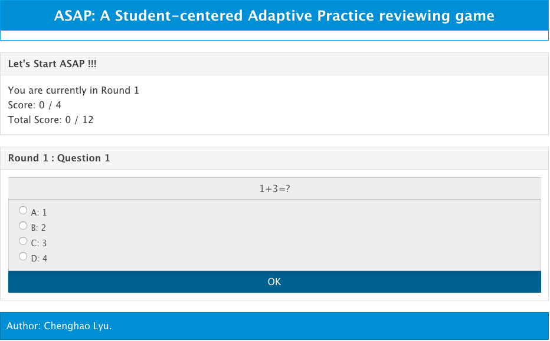
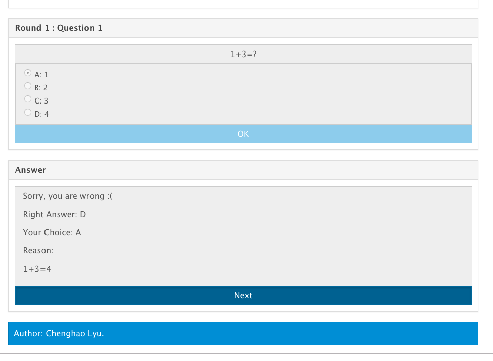
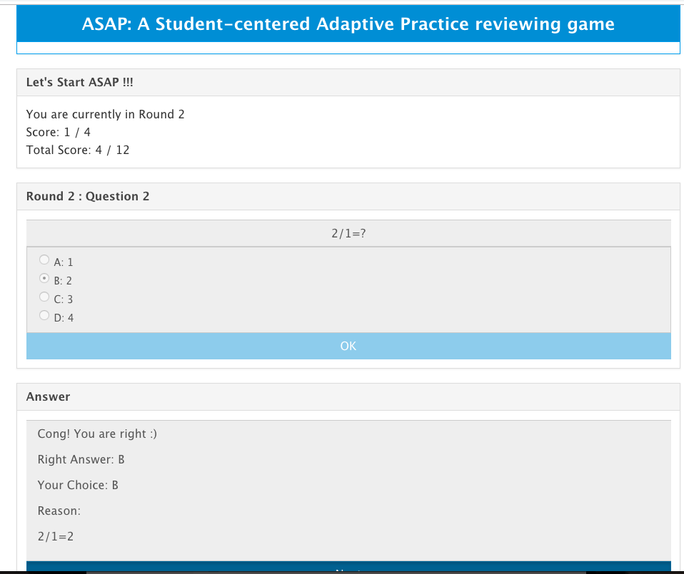
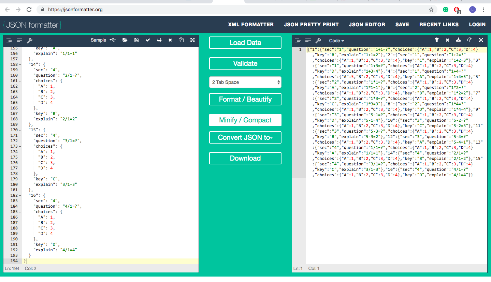

# README

This is the source code of "A Student-centered Adaptive Practice reviewing game" (ASAP) RLO project.

## Introduction

- ASAP provide questions **adaptively** for student to use. 
    + ASAP includes multiple rounds of questions.
    + Each round of questions are genreated *according to the correctness from the last round*. (e.g., If each round has 4 questions, and you have two mistakes in the questions belong to section 1 and section 2, the next round would provide questions mainly from section 1 and section 2)
    + The demo of the RLO is adaptive for question from different sections, which is a decent guide for students to check which section is their weekness and should spend more time to work on.
    + One can also regard the section tag as a hardness tag, which could change ASAP to be hardness adaptive for students.

- ASAP is **resuable**
    + Professors and TAs are easy to update the questions pool following our JSON file format.
    + Since it is a static website, professors can easily use the project by putting the overall file into their personal webpages or the course webpages without the environment configurations for dealing with a dynamic website developed by Flask or Django.

- ASAP is **Anonymous**
    + Students can answer questions in the webpage *without their personal information* -- which will not effect thier final score if they make lots of mistakes.

## Instructions on how student can use it

It is very easy for student to use it and helps them mainly focus on the problem itself (currently, we only include the multiple choices quesitons)

There are three operators a user can use.
1. Choose a option 

   

2. Click "OK" button to confirm the choice. It will show the answer for the quesiton when "OK" is clicked if a choice has been made.

   

3. Click "Next" button to go to the next question.

A student can see their score both for the current round and the entire quesiotn respectively.
​    


## Instructions on how TA/Professor can reuse it

Step 1: Follow the format of a JSON file as follows. 

```
{
  "1": { // "1" is the id of each question
    "sec": "1", // the section of current question
    "question": "1+1=?", // content of question
    "choices": { // choices
      "A": 1,
      "B": 2,
      "C": 3,
      "D": 4
    },
    "key": "B", // the answer
    "explain": "1+1=2" // the explaination for it.
  },
  "2": {
    "sec": "1",
    "question": "1+2=?",
    "choices": {
      "A": 1,
      "B": 2,
      "C": 3,
      "D": 4
    },
    "key": "C",
    "explain": "1+2=3"
  },
  ...
}
```

Step 2: Change the JSON format to a one-line stype by using an online JSON [tool](https://jsonformatter.org/) 



Step 3: Replace or add the new online JSON string in the `./question_pool/test.json` file.

e.g., `test_pool = '<add the one line JSON string here>'`


## Structure of the code

The code is pretty clear and easy for further developing.

- I choose the font-end framework [amazeui](http://amazeui.github.io/docs/en/) for our UI (I include the ccs code in `./ccs`)

- The `index.html` file is mainly developed based on the `amazeui` ccs form.

- I provide every function in `./js/index.js` with comments about what is their usage.

- All the technique needed for develop the webpage is just basic webpage develop knowledge. Check more in those tutorial website: https://www.w3schools.com/js/, https://www.w3schools.com/html/


